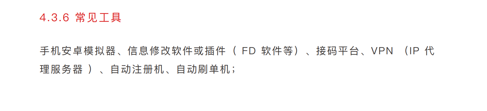
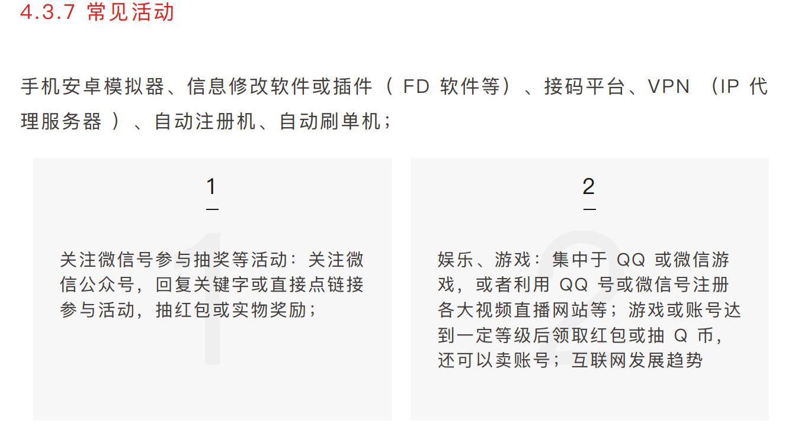
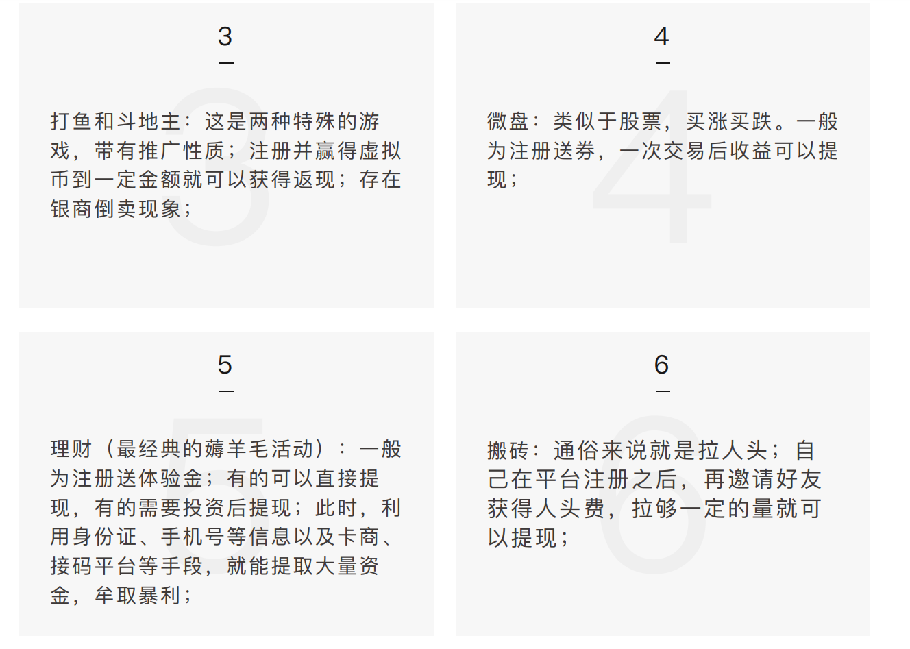
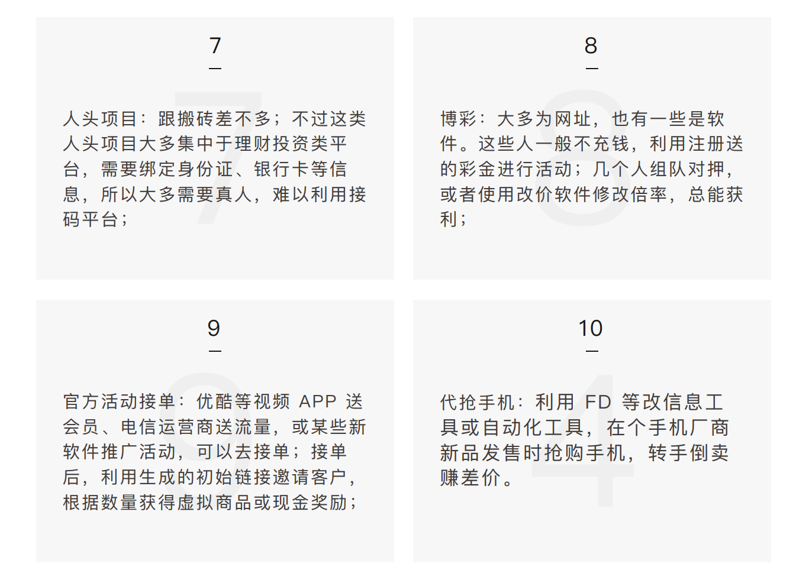

[《Security-PPT》](https://github.com/FeeiCN/Security-PPT)
* [《黑镜调查：深渊背后的真相之 短视频黑灰产业 报告》](https://image.3001.net/uploads/pdf/33d3fae8e35df5e35cfad069d746f755.pdf)
* [《黑镜调查：深渊背后的真相之「薅羊毛产业」报告》](https://image.3001.net/uploads/pdf/4aa87c46888173995c295a873c2aa682.pdf)

    * 羊毛党常用工具  
    <figure>
	
    </figure>
    
    * 羊毛党常见活动  
     <figure>
	
    </figure>   
    
    <figure>  
	
    </figure>  
    
    <figure>
	
    </figure>
    
    * 可以使用知识图谱进行风控，识别作弊、羊毛党   
        * 知识图谱:
            * [一文详解知识图谱关键技术与应用](https://www.jianshu.com/p/3bafc7f9d54c)
            * [知识图谱在风控的应用简述](https://www.4hou.com/technology/4476.html)
    * 常规应对方法
        * 业务逻辑测试：避免业务逻辑的缺陷
        * 代码功能测试：增强请求的服务端校验、避免协议重发等攻击，包括安全性测试
        * 确定应急方案，监控与报警：产出、消耗等的报警，及时发现问题并紧急处理
        * 事后总结与防御规则的更新：甚至可以反追踪羊毛党进行法律追责，起到震慑作用
